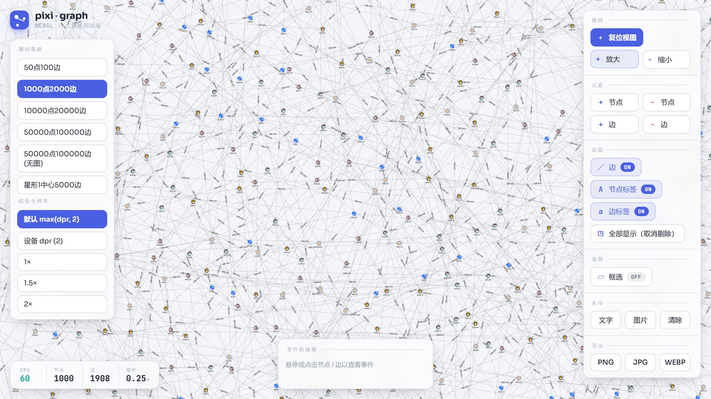

# pixi-graph

[](https://www.npmjs.com/package/pixi-graph)
[](https://www.npmjs.com/package/pixi-graph)

基于 [PIXI.js](https://www.pixijs.com/) **v8** 和 [Graphology](https://graphology.github.io/) 的高性能图可视化库，把图渲染到 WebGL/WebGPU 画布上。

> ⚠️ 本仓库是 [`zakjan/pixi-graph`](https://github.com/zakjan/pixi-graph) 的深度定制分支，在上游基础上新增了水印、框选、箭头/边标签、高性能模式、空格拖拽、双击、图片导出等特性，API 与上游已有较大差异。仍处于演进中，后续可能引入破坏性变更，请自行评估风险后使用。

## 本地预览

仓库自带一个本地交互式 demo（无需任何在线服务）。克隆后：

```
npm install
npm run dev          # 打开 http://localhost:5173
```

默认加载**中等规模**数据集（1000 点 / 2000 边），秒级加载即可看到渲染与交互效果。左侧可一键切换 50 点～50000 点等不同规模的数据集，以及渲染分辨率档位（用于对比清晰度与性能）；右侧控制台覆盖视图复位/缩放、增删节点/边、边与标签显隐、框选、水印、导出 PNG/JPG/WEBP；左下角是实时指标条（FPS / 节点数 / 边数 / 缩放），底部的事件检视器会实时显示悬停、点击到的节点与边。



> **v2** 基于 **PIXI.js v8**，以 ESM 形式发布（同时提供 UMD 包）。`pixi.js`、`pixi-viewport`、`color-rgba`、`eventemitter3` 已作为运行时依赖打入产物；`graphology` / `graphology-types` 为 peer 依赖，由你的打包器统一去重。由于 PIXI v8 的渲染器是**异步初始化**的，请使用 `PixiGraph.create()` 工厂方法来构造。

## 安装

```
npm install pixi-graph graphology graphology-types
```

## 使用

### 基础

```ts
import Graph from 'graphology';
import { PixiGraph } from 'pixi-graph';

const graph = new Graph();
// 向 Graphology 图中填充数据
// 把布局坐标写入节点的 `x`、`y` 属性

const pixiGraph = await PixiGraph.create({
  container: document.getElementById('graph'),
  graph,
  style,
  hoverStyle
});
```

`PixiGraph.create(options)` 会在 WebGL/WebGPU 渲染器就绪后 resolve。（`new PixiGraph(options)` 也可用，并暴露一个 `ready: Promise<this>`；在 `ready` resolve 之前 `viewport`、纹理缓存等字段尚未就绪。）

### 布局

本质上，图布局就是一个 `nodes => positions` 的函数。因此可以使用任意其他库的布局。单独运行布局，再把坐标写入节点的 `x`、`y` 属性即可。

[graphology-layout-forceatlas2](https://github.com/graphology/graphology-layout-forceatlas2) 示例：

```ts
import Graph from 'graphology';
import forceAtlas2 from 'graphology-layout-forceatlas2';

const graph = new Graph();
// 向 Graphology 图中填充数据

graph.forEachNode(node => {
  graph.setNodeAttribute(node, 'x', Math.random());
  graph.setNodeAttribute(node, 'y', Math.random());
});
forceAtlas2.assign(graph, { iterations: 300, settings: { ...forceAtlas2.inferSettings(graph), scalingRatio: 80 }});

const pixiGraph = await PixiGraph.create({ ..., graph });
```

### 样式

```ts
const style = {
  node: {
    color: '#000000',
  },
  edge: {
    color: '#000000',
  },
};

const pixiGraph = await PixiGraph.create({ ..., style });
```

#### 颜色

颜色通过 [color-rgba](https://github.com/colorjs/color-rgba) 解析。支持以下 CSS 颜色字符串：具名颜色、hex、简写 hex、RGB、RGBA、HSL、HSLA。

#### Web 字体

在创建 PixiGraph 之前，用 [FontFaceObserver](https://github.com/bramstein/fontfaceobserver) 预加载字体。

[Material Icons](https://google.github.io/material-design-icons/) 示例：

```html
<link href="https://fonts.googleapis.com/icon?family=Material+Icons" rel="stylesheet">
```

```ts
const style = {
  node: {
    icon: {
      content: 'person',
      fontFamily: 'Material Icons',
    },
  },
};

await new FontFaceObserver('Material Icons').load();

const pixiGraph = await PixiGraph.create({ ..., style });
```

#### 位图字体

标签/图标的文本类型由样式里的 `type` 决定（见 `TextType`）：

- `TextType.TEXT` —— 普通 Canvas/WebGL 文本（默认）。
- `TextType.BITMAP_TEXT` —— 位图字体文本，适合大量重复文本时降低开销。
- `TextType.IMAGE` —— 以图片作为内容。

使用位图字体前，请先用 PIXI v8 的 `Assets` 加载好对应的 `.fnt`/`.xml` 位图字体，再在样式中引用其 `fontFamily`：

```ts
import { Assets, TextType } from 'pixi.js';

await Assets.load('https://example.com/HelveticaRegular.fnt');

const style = {
  node: {
    label: {
      content: node => node.id,
      type: TextType.BITMAP_TEXT,
      fontFamily: 'HelveticaRegular',
    },
  },
};

const pixiGraph = await PixiGraph.create({ ..., style });
```

#### 悬停样式

节点/边被悬停时，`hoverStyle` 中的值会覆盖基础 `style` 中的值。

```ts
const style = {
  node: { color: '#000000' },
  edge: { color: '#000000' },
};
const hoverStyle = {
  node: { color: '#ff0000' },
  edge: { color: '#ff0000' },
};

const pixiGraph = await PixiGraph.create({ ..., style, hoverStyle });
```

⚠️ 随着其他状态的实现，此处可能变化

## API

### 构造选项

```ts
export interface HighPerformanceThreshold {
  nodeNumber: number;
  edgeNumber: number;
}

export interface GraphOptions<NodeAttributes extends BaseNodeAttributes = BaseNodeAttributes, EdgeAttributes extends BaseEdgeAttributes = BaseEdgeAttributes> {
  container: HTMLElement;
  graph: Graphology.AbstractGraph<NodeAttributes, EdgeAttributes>;
  style: GraphStyleDefinition<NodeAttributes, EdgeAttributes>;
  hoverStyle: GraphStyleDefinition<NodeAttributes, EdgeAttributes>;
  spaceDrag?: boolean;
  dragOffset?: boolean;
  highPerformance?: HighPerformanceThreshold;
  minScale?: number;
  maxScale?: number;
  resolution?: number;
}

export class PixiGraph<NodeAttributes extends BaseNodeAttributes = BaseNodeAttributes, EdgeAttributes extends BaseEdgeAttributes = BaseEdgeAttributes> {
  static create(options: GraphOptions): Promise<PixiGraph>;
  constructor(options: GraphOptions<NodeAttributes, EdgeAttributes>);
  readonly ready: Promise<this>;
  readonly resolution: number;
}
```

- `container` —— 用作容器的 HTML 元素，画布会被追加进来并随其尺寸自适应
- `graph` —— [Graphology](https://graphology.github.io/) 图（节点需要 `x`、`y` 属性；图变更会实时同步到画布）
- `style` —— 样式定义
- `hoverStyle` —— 悬停状态的附加样式定义
  - ⚠️ 随着其他状态的实现，此处可能变化
- `spaceDrag` —— 仅在按住空格时平移（让普通拖拽可用于框选）
- `dragOffset` —— 拖拽时保持光标与节点的偏移，而非吸附到节点中心
- `highPerformance` —— 节点/边数量超过 `{ nodeNumber, edgeNumber }` 阈值时，进入高性能模式：交互（平移/缩放/拖拽）期间隐藏边与节点标签，交互结束后恢复
- `minScale` / `maxScale` —— 最小/最大缩放比例（默认 `0.1` / `2`）
- `resolution` —— 渲染分辨率（画布物理像素 / CSS 像素），默认 `max(devicePixelRatio, 2)`：Windows 低 DPI 屏（`devicePixelRatio = 1`）会按 2× 超采样以消除锯齿，代价约 4 倍像素填充量；超大图可显式传 `window.devicePixelRatio` 换性能

### 实例方法

视图与缩放：

- `resetView(nodes: string[])` —— 根据给定节点重新计算世界尺寸并居中、铺满视口
- `zoomIn()` / `zoomOut()` —— 以一档为步长放大/缩小
- `uncull()` —— 把所有元素重新标记为屏内可见（整图导出前会用到）

可见性与可渲染开关：

- `setNodeVisible(nodeKey, visible)` / `isNodeVisible(nodeKey)`
- `setEdgeVisible(edgeKey, visible)` / `isEdgeVisible(edgeKey)`
- `setEdgesRenderable(renderable)` / `setEdgeLabelsRenderable(renderable)`
- `setNodeLabelsRenderable(renderable)`
- `setNodeEdgesRenderable(nodeKey, renderable)` —— 单独控制某节点的关联边是否渲染

导出与水印：

- `extract(full?, format?, quality?): Promise<string>` —— 把当前视图导出为 base64 图片（`format` 支持 `'png' | 'jpg' | 'webp'`，默认 `png`/`0.92`）
- `createWatermark(option): string` / `removeWatermark(name)` / `clearWatermark()`

框选（需配合事件回调使用）：

- `enableAutoSelect(complete, lazy?, realTime?)` —— viewport 内框选，仅在开启 `spaceDrag` 时生效
- `enableSelect(complete, lazy?, realTime?, onStateChange?)` —— DOM 覆盖层框选（按住 Shift 拖拽，或调用 `pixiGraph.choose.open()`）
  - 回调收到 `SelectionResult`：`{ nodes: string[]; edges: string[] }`
  - 也可直接用导出的纯函数 `selectInRectangle` 做命中判定

生命周期：

- `destroy()` —— 注销它添加过的每一个监听（viewport、graph、document、ResizeObserver），销毁纹理与 PIXI 对象

### 样式定义

`GraphStyle` 接口表示已解析的样式，所有值都是必填的。

`GraphStyleDefinition` 接口允许在任意 key 上使用函数或省略值。函数会被解析，省略的值回退到上一层定义或默认值（默认值见 `src/core/constants.ts` 的 `DEFAULT_STYLE`）。

```ts
export interface GraphStyle {
  node: {
    size: number;
    color: string;
    border: {
      width: number;
      color: string;
    };
    icon: {
      content: string;
      type: TextType;
      fontFamily: string;
      fontSize: number;
      color: string;
    };
    label: {
      content: string;
      type: TextType;
      fontFamily: string;
      fontSize: number;
      color: string;
      backgroundColor: string;
      padding: number;
    };
  };
  edge: {
    width: number;
    color: string;
  };
}

export type NodeStyle = GraphStyle['node'];
export type EdgeStyle = GraphStyle['edge'];

export type StyleDefinition<Style, Attributes> =
  ((attributes: Attributes) => Style) |
  {[Key in keyof Style]?: StyleDefinition<Style[Key], Attributes>} |
  Style;

export interface GraphStyleDefinition<NodeAttributes extends BaseNodeAttributes = BaseNodeAttributes, EdgeAttributes extends BaseEdgeAttributes = BaseEdgeAttributes> {
  node?: StyleDefinition<NodeStyle, NodeAttributes>;
  edge?: StyleDefinition<EdgeStyle, EdgeAttributes>;
}
```

这允许在任意样式层级使用静态样式或数据驱动样式。每个函数只解析一次，并按属性对象标识 + 悬停状态缓存。

```ts
// 静态
const style = {
  node: { color: '#000000' },
};

// 单值函数（数据驱动）
const style = {
  node: { color: node => colors[node.group % colors.length] },
};

// 整段函数
const style = {
  node: node => {
    const color = colors[node.group % colors.length];
    return { color };
  },
};
```

### 事件

节点事件：

- `nodeClick`、`nodeDbclick`、`nodeRightclick`
- `nodeMousemove`、`nodeMouseover`、`nodeMouseout`、`nodeMousedown`、`nodeMouseup`
- `nodeMoveStart` / `nodeMove` / `nodeMoveEnd`（节点拖拽，回调携带 `point`）

```ts
pixiGraph.on('nodeClick', (event, nodeKey, nodeStyle) => ...);
```

边事件：

- `edgeClick`、`edgeDbclick`、`edgeRightclick`
- `edgeMousemove`、`edgeMouseover`、`edgeMouseout`、`edgeMousedown`、`edgeMouseup`

```ts
pixiGraph.on('edgeClick', (event, edgeKey, edgeStyle) => ...);
```

视口事件：`viewportClick`、`viewportRightClick`。

## 高性能架构

面向大图（数万节点/边）的优化分布在几个层次，详见 [`docs/high-performance-architecture.md`](docs/high-performance-architecture.md)：

- **样式层**：把纯对象样式定义编译为可缓存的解析结果，按属性对象标识失效，避免每次变更都递归深合并。
- **纹理缓存**（`textures/TextureCache.ts`）：节点/标签先以 2× 分辨率烘焙到缓存 `Texture`，再以 `Sprite` 绘制；cache key 必须包含每一个视觉属性。
- **批量边层**（`renderers/BatchEdgeLayer.ts`）：高性能模式下用批量绘制承载可见边。
- **空间索引**（`core/SpatialNodeIndex.ts`）：均匀网格索引，让相机移动时只处理可见节点，而非扫描所有显示对象。
- **脏边调度**（`core/EdgeUpdateScheduler.ts`）：节点位置更新后把关联边标记为脏，每帧合并刷新一次；高性能拖拽期间推迟到交互结束。
- **LOD 与剔除**：`viewport` `frame-end` 且 dirty 时，把缩放映射到离散 `zoomStep` 桶切换各部分可见性，并剔除屏外元素。

## 架构概览

入口 `src/index.ts` 仅重导出 `PixiGraph` 与各类型。核心逻辑在 `src/PixiGraph.ts`，它持有 PIXI `Application`、`pixi-viewport` 的 `Viewport` 与 PIXI 的 `Culler`，订阅 Graphology 图变更事件保持画布同步，并把具体职责委托给 `controllers/`。

```
src/
  PixiGraph.ts            编排核心，对外 API
  controllers/            从核心拆出的职责：
    GraphEventController.ts        图事件订阅 → 转发为带类型事件
    GraphMutationController.ts     增删节点/边、可见性、脏边调度
    GraphRenderController.ts       图层、LOD、剔除、导出、水印
    NodeDragController.ts          节点拖拽
    ViewportInteractionController.ts 平移/缩放/点击
  elements/               PixiNode / PixiEdge 包装类（持有 Container、重发事件）
  renderers/              无状态绘制函数：node / nodeLabel / edge / edgeArrow / edgeLabel
                          + GraphLayers（分层 Container）+ BatchEdgeLayer（批量边）
  textures/               TextureCache 纹理缓存
  style/                  样式解析与默认值合并
  features/               自包含特性：selection（框选）、watermark（水印）、spaceDrag（空格拖拽）
  core/                   constants、types、空间/并行边索引、脏边调度、图包围盒
  utils/                  color / text / throttle / validate / pointer
```

显示层按 z 序加入 viewport：`edgeLayer`、`edgeLabelLayer`、`nodeLabelLayer`、`nodeLayer`；`watermarkLayer` 加在 `app.stage` 索引 0（位于 viewport 之后，不随平移/缩放变化）。

## 开发

使用 [Vite](https://vitejs.dev/)（开发服务器 + 库构建）和 [Vitest](https://vitest.dev/) 构建。

```
npm run dev        # 在 localhost:5173 启动演示，带热模块替换（HMR）
npm run build      # tsc --noEmit 类型检查 + 构建 dist/（ESM + UMD + .d.ts）
npm test           # 运行单元测试（vitest run）
npm run test:watch # 监听模式
npm run lint       # eslint + prettier 检查
npm run format     # prettier 写回
npm run typecheck  # tsc --noEmit
```

演示页（`demo/main.ts`）通过 `pixi-graph` 别名（见 `vite.config.ts`）直接引用 `src/` 源码，因此改动源码会经 HMR 立即生效，**无需先 `build`**。`dist/` 仅供外部使用者，且被 gitignore。

演示页提供了完整的控制面板：左侧切换数据集与渲染分辨率（二者均通过 URL 参数 `?data=` / `?resolution=` 重载页面生效），右侧控制台可验证动态增删节点/边、显隐开关、框选、水印、缩放、复位视图、三种格式导出，左下角实时指标条与底部事件检视器用于观察 FPS 与节点/边事件。

### 大图 benchmark

启动开发服务器后访问：

```
http://localhost:5173/?bench=1&data=data-50000-100000
```

`bench=1` 会在 demo 完成加载后自动输出一份 `pixiGraphBenchmark` 报告到控制台和 `window.pixiGraphBenchmark`，覆盖下载/建图/布局/`PixiGraph.create`、框选命中、单节点位置更新、缩放和 uncull 等阶段。它**不会**自动执行 `extract()`，避免 benchmark 本身触发额外的大图离屏渲染。可用 `data=` 切换 `demo/data/*.json` 数据集；不传 `data` 时默认使用 `data-50000-100000`。

## 赞助

<a href="https://reflect.app/"></a>
